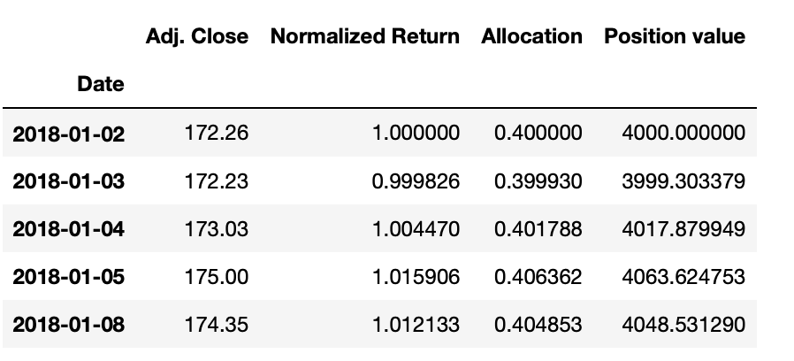
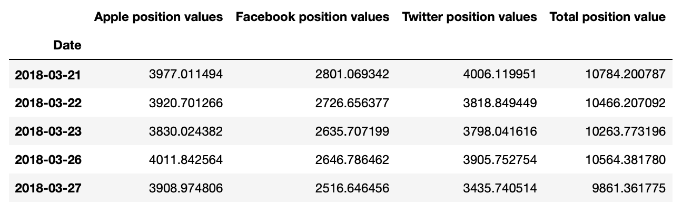
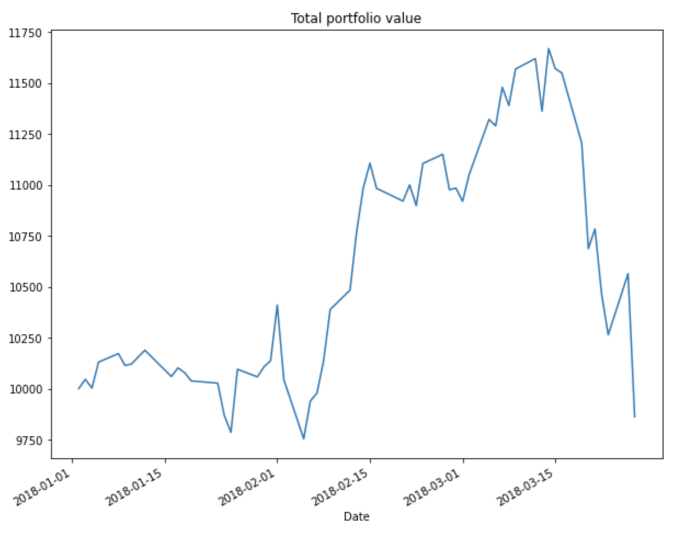
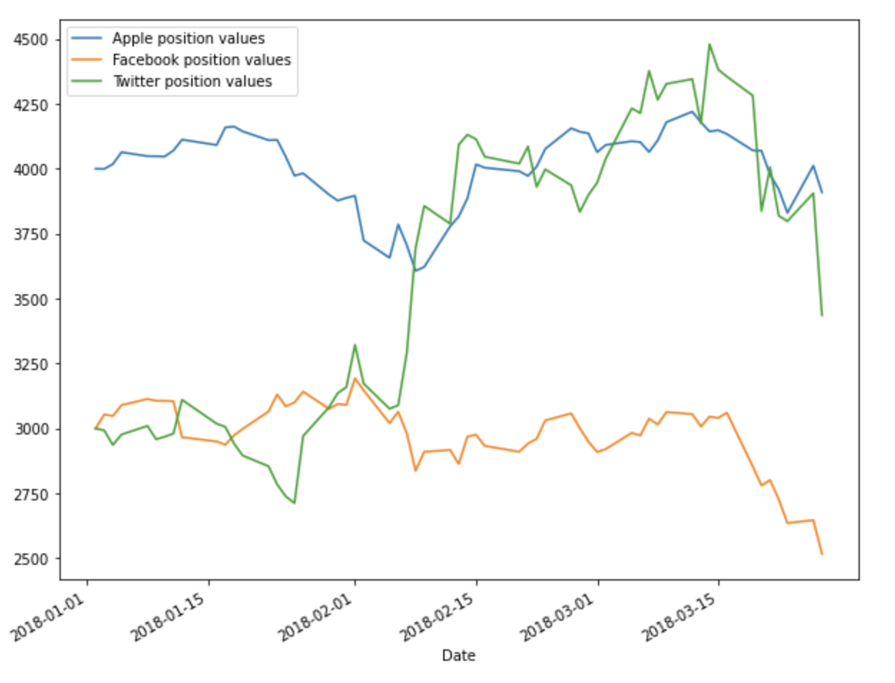
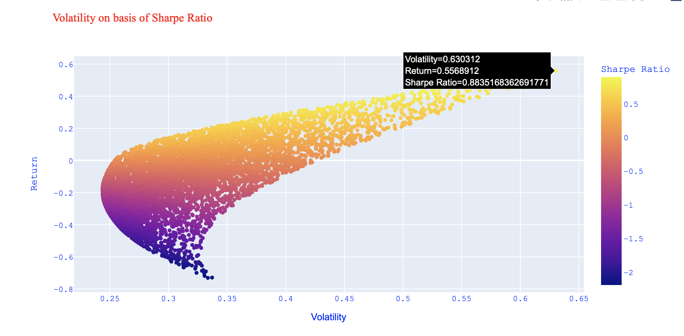

# portfolio-study
An implementation to study the portfolio allocation, position values, and returns for Apple, Facebook and Twitter.

## Returns, Allocations & Position values
We will extract data from Apple, Facebook and Twitter from 2018 to 2020. We would then calculate the normalized return. We would assume that, 30% of the money is allocated to facebook stock, 30% of the money is allocated to twitter stock and 40% of the money is allocated to apple stock. Allocations = multiplying the percent with the returns.

We assume to make an investment of 10000€ on the companies with aforementioned percentage of allocation. The position value is calculated as multiplication of investment and allocation

Let's look at the position values of Apple Inc. 

From the above data, it can be inferred that, 4000€ was allocated to Apple Inc. on 2nd January 2018 and then on the next day since the stock went down the money became approximately 3999€ and on the 3rd day it rose to 4017€. Likewise the price value for the stock was rising and falling for the following days.

Let's take a look at position values of all the companies and their total position values during end of the term

Now, to understand the total fluctuation of the portfolio during the entire term of investment. Let's see below plot,

So, by the end of the term, the returns for the amount/principle invested on the different stocks is approximately at 9861 euros.

From the above plot, it can be understood that the stock of Twitter has grown in an upward trend whereas the other two stocks of Apple & Facebook didnt have much variance. We can say that the investment on Apple stock has given break-even return, whereas investment on twitter had a downward trend.

## Portfolio statistics
Statistics like daily returns, mean/average daily returns and standard deviation are calculated. 'pct_change' function will calculate the percentage change between the current and a prior element. The period to change/shift is 1

## Sharpe ratio
Volatility is defined as the fluctuations/variance in the price of the portfolio. Sharpe ratio is used to calculate the average return obtained with respect to the risk free rate per unit of volatility. Hence, it determines the return on the investment with respect to its risk

Higher the sharpe ratio, higher the returns on investment

Here, the risk free rate per unit is considered to be zero

## Optimization method - Randomization
### Allocation of random weights to the stocks
The weights are randomly allocated to the stocks, such that they sum of those weights = 1 and the weights are rebalanced by dividing it by the sum of weights

The weight allocations, return on investment and volatility/variance are obtained where sharpe ratio is maximum

The plot shows representation of volatility on the basis of sharpe ratio. The highest sharpe ratio is also highlighted in the figure